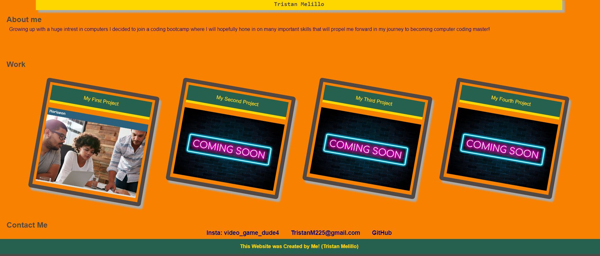

# Portfolio
This is my portfolio site where I will be adding all my worked on projects and details about myself and how to reach me! I will be updating it regularly!

## General Information
- This project will be regularly updated to show my improvement in my ability to code and understand code!
- This Project hold my Portfolio for viewing employers

## Features
- Clicking on a image of one of my projects will take you to my projects deployed page.

## Screenshots / Links

Links to my deployed page! 
https://tristanm225.github.io/Portfolio/ 

## Setup
N/A

## Usage
To get scouted for a job!

## Project Status
Project is: _in progress_ 
This will be a on going project because learning will never stop!

## Room for Improvement
Include areas you believe need improvement / could be improved. Also add TODOs for future development.

Room for improvement:
- Styling
- Cleaning up text / removing unneccessary code

To do:
- Animations
- Interactivity
- Possible gradiance
- Adding additional projects

## Credit / Acknowledgements 
Took ideas from 22-Stu_Mini-Project from the UCSD coding boot camp folder

Learned how to add a image to the title bar from WBdocs https://www.w3docs.com/snippets/html/how-to-add-an-image-in-the-title-bar.html 

Took the zoom function from W3 https://www.w3schools.com/howto/howto_css_zoom_hover.asp 

## Contact
Created by TristanM225 Reach out to me by email! TristanM225@gmail.com
